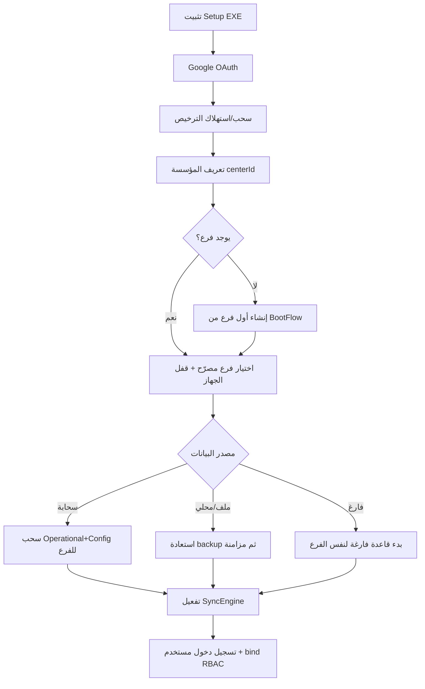

# دليل عمليات المزامنة والفروع والنسخ (V2-5.9)

تقرير تشغيلي يشرح **كيف تنتقل بيانات الفرع بين الأجهزة** عبر الرفع والسحب والإنشاء والنقل — وما الذي يحدث عند إضافة فرع جديد.

> الحالة: وثيقة تصميم/تشغيل للكود الحالي. إثبات Windows UAT لكل المسارات ما زال **UNVERIFIED**.

---

## 1) المكوّنات الأساسية

| الطبقة | الدور |
|--------|--------|
| **License (`license.json`)** | هوية المركز، حدود الفروع/الأجهزة، قائمة الفروع المسجّلة، الأجهزة المعتمدة |
| **Config Layer** | إعدادات/أسعار/خدمات/باقات/مستخدمون لكل فرع على Drive |
| **Operational Layer** | عملاء، زيارات، حجوزات، مصروفات، حضور… مفصولة بـ `branchId` |
| **SyncEngine** | دفع عند الكتابة + سحب دوري (poll) |
| **Backup V1 Cloud DB** | نسخة ZIP مشفّرة كاملة للجهاز → Google Drive |
| **Backup V2** | حزمة `.tdw` محلية (+ رفع اختياري) محمية بـ RBAC |
| **RBAC Session** | جلسة في عملية Electron الرئيسية قبل أي IPC محمي |
| **Owner Mode / Branch Mode** | Owner = نظرة عامة؛ Branch Mode = العمل داخل فرع واحد |

مسار Drive النموذجي (مبسّط):

```text
NajjarTech/<centerId>/
  license.json
  Branches/<branchId>/
    Config/   (settings, prices, users, …)
    Operational/ (clients, cases, bookings, …)
    versions.json
  Backups/…   (نسخ سحابية كاملة / V2)
```

---

## 2) دورة الحياة من الصفر (جهاز جديد)



خطوات مختصرة:

1. **Google** يربط الحساب السحابي (لا يمنح صلاحية Owner).
2. **الترخيص** يُسحب/`consume` ويُحفظ محلياً + كاش Electron.
3. **الفرع** يُقفل على الجهاز (`DeviceConfig.lockToBranch`) حتى لا يسحب فرعاً آخر بالخطأ.
4. **مصدر البيانات**: سحابة / ملف / فارغ — مع نسخة أمان قبل الاستعادة عند الحاجة.
5. **المزامنة** تُفعَّل افتراضياً بعد اكتمال التفعيل (`ActivationSyncDefaults`).
6. **تسجيل الدخول** يربط جلسة RBAC في `main` — مطلوبة للنسخ السحابي وBackup V2.

---

## 3) إنشاء فرع جديد (Owner Hub)

1. Owner يطلب **Add Branch** → حوار `tdwAskText` (لا `prompt()`).
2. `BranchEnrollment.enrollBranch` يولّد معرّفاً (`BR-MAIN`, `BR02`, …) ضمن `maxBranches`.
3. يُحدَّث `license.json` محلياً ثم يُرفع إلى Drive.
4. الفرع **يبدأ فارغاً** — لا يُنسخ العملاء/الفواتير من الفرع الحالي.
5. يُفعَّل تلقائياً **Branch Mode** على الفرع الجديد حتى لا تظهر بيانات الفرع السابق في شاشة العملاء.
6. الملخصات (`BranchSummary`) للفرع الجديد = أصفار حتى تُنشأ بيانات محلية أو تُسحب من أجهزته.

| ماذا يُشارك بين الفروع؟ | ماذا يُفصل؟ |
|-------------------------|-------------|
| الترخيص، حدود الأجهزة، حساب Google للمركز | العملاء، الزيارات، الحجوزات، المصروفات التشغيلية |
| باقات/خدمات قد تُنسخ يدوياً لاحقاً عبر Config | `branchId` على كل سجل تشغيلي |

---

## 4) الرفع (Push)

عند تعديل جدول تشغيلي أو إعدادات:

1. الكتابة المحلية → `localStorage` (+ SQLite إن كان `sqlitePrimary`).
2. `SyncEngine.schedulePush(table, branchId)` (debounce ~2ث).
3. التصدير عبر `OperationalLayer.exportTable` / `ConfigLayer` **مفلتر بـ branchId**.
4. الرفع إلى مسار الفرع على Drive + تحديث `versions.json`.
5. عند الفشل: طابور outbox / pending لإعادة المحاولة.

**Cloud DB Backup (زر نسخ الآن / sync):**

1. يتطلب Google متصل **و** `ensureRbacSessionBound()` ناجح (رتبة ≥ admin للنسخ الكامل).
2. إنشاء أرشيف مشفّر بكلمة مرور النسخ.
3. `backup:uploadDbBackup` / `syncDbBackup` عبر IPC المحمي.
4. تسجيل النتيجة في سجل النسخ (نجاح / `rbac_session_required` / خطأ شبكة).

**Backup V2:**

1. `ensureRbacSessionBound()` ثم `backup:v2:create`.
2. ملف محلي `.tdw`؛ الرفع السحابي اختياري إن طُلب `cloud/upload`.

---

## 5) السحب (Pull)

1. `SyncEngine` يعمل poll (افتراضي ~15ث) إن كان Cloud V2 مفعّلاً والجهاز مصرّحاً.
2. يقرأ `versions.json` البعيد ويقارن بالمحلي.
3. إن وُجد أحدث: تنزيل الملف → `importTable` مع دمج (`RecordMerger`) ووسم `branchId`.
4. جهاز مقفول على فرع: `shouldSyncBranch` يمنع سحب فروع أخرى.
5. التعارضات تُسجَّل في `ConflictQueue` ولا تُمسح بصمت.

---

## 6) النقل بين الأجهزة (نفس الفرع)

```text
جهاز A (فرع BR02) --push--> Drive/Branches/BR02/...
                              |
جهاز B (مقفل على BR02) <--pull-- نفس المسار
```

- نفس `centerId` + نفس `branchId` + جهاز معتمد في الترخيص.
- كلمات مرور المستخدمين تنتقل عبر `users.json` (Config) بعد تغييرها ودفعها — جهاز الاستقبال يسحب عند poll/login.
- نسخة **Cloud DB** الكاملة تنقل لقطة الجهاز بالكامل (كل الجداول المحلية) وهي مسار استعادة كوارث أكثر من مزامنة حية.

---

## 7) الاستعادة (Restore)

| المصدر | السلوك |
|--------|--------|
| سحابة Cloud DB | تنزيل → فك تشفير → استبدال قاعدة → إعادة تشغيل |
| ملف محلي / Backup V2 | معالج استعادة + بوابة تحقق |
| قبل الاستعادة | يُفضَّل `pre-restore` backup محلي/سحابي |
| بعد الاستعادة | محاولة دفع سحابي + تشغيل Sync defaults |

فشل شائع كان: Google ✅ لكن الرفع ❌ بسبب عدم ربط RBAC — يُعالج بـ bind عند الدخول + إعادة bind قبل الرفع، والثقة بالـ claim إذا كان KV المستخدمين فارغاً في main.

---

## 8) الجلسات والصلاحيات (مهم للنسخ)

```text
Login → completeAuthenticatedLogin
      → rbac.bindSession (عام)
      → persistKv(users) بعد نجاح الجلسة
      → قنوات backup/v2/upload تصبح مسموحة حسب الرتبة
Logout → confirm أصلي (Electron MessageBox sync) → clearSession → إعادة تحميل
```

| رمز الخطأ | المعنى | العلاج |
|-----------|--------|--------|
| `rbac_session_required` | لا جلسة في main | أعد تسجيل الدخول؛ تأكد أن النسخ بعد login |
| `rbac_rank_denied` | الرتبة أقل من المطلوب | استخدم admin/owner للنسخ الكامل |
| `user_not_found` | المستخدم غير موجود في KV | يُعاد bind مع skip ثم يُفلَش users |

---

## 9) قواعد عزل بيانات الفرع

1. كل سجل تشغيلي جديد يُوسَم بـ `branchId` النشط (`ensureRecordBranch`).
2. السجلات القديمة بلا `branchId` تُعامل كـ `BR-MAIN`.
3. **Branch Mode** / جهاز مقفول → واجهة العملاء تعرض الفرع النشط فقط.
4. **Owner Mode** → نظرة عامة؛ الكتابة اليومية تتطلب الدخول لـ Branch Mode.
5. المزامنة على Drive تفصل الملفات حسب الفرع؛ لا تُخلط تلقائياً عند «Add Branch».

---

## 10) قائمة تحقق سريعة للمستخدم

1. سجّل دخول Owner/Admin بعد الاستعادة.
2. تأكد Google ✅ **ثم** جرّب «نسخ الآن» — إن ظهر `rbac_session_required` أعد الدخول مرة واحدة.
3. لإنشاء فرع جديد: Owner Hub → Add Branch → يجب أن يكون الفرع فارغاً وBranch Mode مفعّلاً.
4. لتشغيل فرع على جهاز ثانٍ: فعّل الترخيص → اقفل الجهاز على نفس `branchId` → اختر سحب سحابي أو استعادة.
5. لتسجيل الخروج: نافذة تأكيد النظام (Electron) — ليس توست «confirm غير مدعوم».

---

## 11) ما زال يحتاج إثبات Windows

- مزامنة جهاز A ↔ B لنفس الفرع في الوقت الحقيقي  
- نسخ سحابي بعد استعادة محلية بدون `rbac_session_required`  
- إنشاء فرع جديد بلا ظهور عملاء الفرع السابق  
- تسجيل خروج بدون رسالة polyfill  

**Ready for release / main: NO** حتى اكتمال UAT على Setup EXE.
